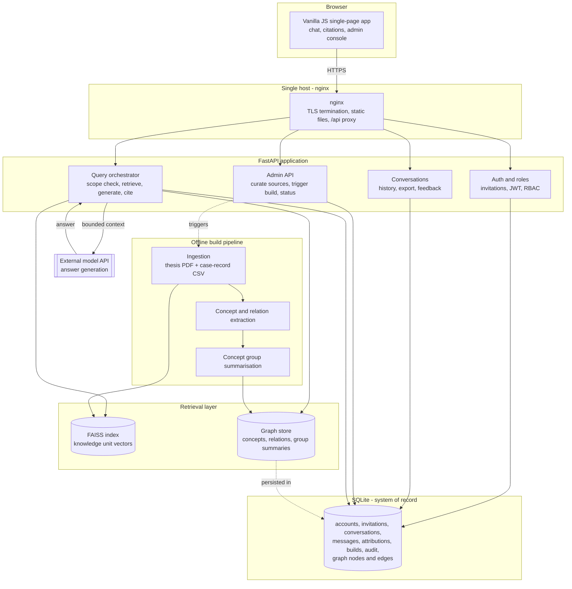

# Architecture & Tech Stack Notes

**Feature**: Congenital Toxoplasmosis Clinical Knowledge Assistant
**Companion to**: [spec.md](./spec.md)
**Created**: 2026-08-06
**Status**: Input to `/speckit-plan` — not binding

---

## Why this document is separate

`spec.md` deliberately says *what* the system must do and avoids naming technologies, because that is what the Spec Kit template requires and what keeps the spec reviewable by a non-implementer. The request also asked for an architecture sketch, an ingestion design, a prompt lifecycle, and cost-effective stack recommendations — all of which are *how*. Those live here, so the spec stays clean and the engineering opinions stay explicit and challengeable.

Everything below is a recommendation. `/speckit-plan` is where it gets ratified or replaced.

---

## 1. System overview

The shape worth noticing: **the build pipeline is offline and the query path never writes to the knowledge base.** A doctor's question reads the graph and the vector index; it never mutates them. That is what makes FR-023 (a failed build leaves the previous one serving) and FR-005-style atomic swaps straightforward — build into a new generation, then flip a pointer.

---

## 2. Data ingestion and processing

The two sources are structurally different and should not go through the same pipeline. Forcing the CSV through a PDF-shaped chunker is the single most likely way to make this project worse than the plain RAG it is replacing.

### 2a. The case-record dataset (`logs/request-logs.csv`)

24 rows, 29 columns. Each row is already a complete, structured clinical reasoning artifact: inputs (`first_igm`, `first_igg`, `first_avidity`, `first_weeks`, `child_igm`, `child_iga`, `child_igg`, `fundoscopic`, `neuroimaging`, `pcr_la`, …), derived classifications (`mother_classification`, `child_classification`, `final_situation`), and free-text `argumentation` and `recommendation` in Portuguese.

**Extraction here should be deterministic, not LLM-driven.** The columns *are* the schema. Mapping them to graph concepts is a `for` loop, and doing it in code rather than by prompting a model makes it free, instant, reproducible, and impossible to hallucinate. This is a real advantage over generic GraphRAG pipelines, which pay an LLM to rediscover structure that is already present.

Per row, emit:

- One `CaseRecord` node, keyed by the CSV `id`, holding the full row plus its `argumentation` and `recommendation` text.
- One `Concept` node per distinct marker-result pair (`IgM=Positive`, `IgG avidity=Low`, `Fundoscopy=Normal`, …), reused across rows.
- One `Concept` node per classification value — there are only 5 distinct `mother_classification` values and 4 distinct `child_classification` values across the dataset, which makes them excellent hub nodes.
- Edges: `CaseRecord —exhibits→ Concept`, `CaseRecord —classified_as→ Classification`, `CaseRecord —recommends→ Recommendation`, and a `Concept —co_occurs_with→ Concept` edge weighted by how often two findings appear together.

One vector embedding per `CaseRecord`, over a rendered natural-language summary of the row (not the raw CSV line) — so that a doctor describing a case in prose retrieves the right records. The record stays atomic (FR-018).

**Validate on the way in.** `final_situation` and the `mother_situation` family are numeric codes whose meaning lives in the source application, not in the CSV. Either resolve them to labels via a checked-in mapping or drop them from the graph; carrying unexplained integers into a clinical answer is worse than omitting them. Note also that 7 of 24 rows carry `mother_classification = "Situação não parametrizada"` — nearly a third of the corpus is explicitly *unclassified*, which the retrieval layer must not present as a classification.

### 2b. The thesis (`text/monografia.pdf`)

This is the path where standard GraphRAG applies: extract text, split on structure (headings and sections, falling back to a token window with overlap), embed each passage, and run one LLM extraction pass per passage to pull concepts and relations, constrained to the concept types in FR-027 so the graph stays joinable with the CSV-derived nodes.

This LLM pass is a **one-off build cost**, not a per-question cost, and it should be cached keyed by content hash so re-running a build after an unrelated change costs nothing. For a document this size, expect a small number of pounds per full extraction — cheap enough that the build can be re-run freely.

Preserve page or section references at extraction time (FR-017); retrofitting citation anchors afterwards is painful and lossy.

### 2c. Joining the two, and summarising

The join is what makes the graph earn its place: a concept extracted from the thesis (say, *low IgG avidity*) and the same concept derived from the CSV must resolve to **one** node. Normalise concept names against a small controlled vocabulary derived from the CSV's own distinct values, and treat anything the thesis surfaces that doesn't match as a new node rather than fuzzily merging it. Once joined, a question can enter through the thesis's explanatory text and walk out into the historical cases that exhibit the same finding — which is precisely the capability a pure vector store cannot provide.

For FR-030, cluster the graph (Leiden or connected-component clustering is ample at this scale) and generate one summary per cluster at build time. At 24 records these clusters will be small; the summaries matter more as the case corpus grows.

### 2d. Build lifecycle

Build into a new generation directory and a new set of graph rows tagged with a build id, verify it answers a smoke-test question set, then atomically switch the "active build" pointer. Keep the previous generation on disk for rollback. This gives FR-022, FR-023, and FR-025 almost for free, and it is far simpler than trying to mutate a live index safely.

---

## 3. Core workflow: a doctor's question

1. **Submit.** The browser posts the question plus a conversation id with a bearer token. The request is rejected here if the token is invalid, the account is revoked, the rate limit is exceeded, or the question exceeds the length bound.
2. **Screen.** Check for direct patient identifiers (FR-049) and warn before processing. Check the question is in scope (FR-035) — at this corpus size a cheap classifier call, or an embedding-similarity threshold against the corpus centroid, is enough; reserve the expensive path for questions that pass.
3. **Contextualise.** Rewrite the question into a standalone form using the recent conversation turns, so "and if the avidity were high?" becomes a retrievable query (FR-034).
4. **Retrieve, two ways in parallel.** Vector search over knowledge units for textual similarity, and concept-anchored graph traversal: identify the concepts named in the question, walk to the case records and thesis passages connected to them, and pull the relevant concept-group summaries for broad questions.
5. **Merge and rank.** Combine both result sets, deduplicate by knowledge unit, and rank. Truncate to a fixed context budget (FR-031). Record exactly which units survived — this set becomes the answer's attributions and must be captured *before* generation, not reconstructed after.
6. **Generate.** Send the safety-framed system prompt, the ranked context with unit identifiers attached, the conversation history, and the question to the model. Require the model to cite unit identifiers inline. Stream the response so FR-003's two-second visible-progress target is met regardless of total generation time.
7. **Verify and attribute.** Resolve every cited identifier against the units actually retrieved, and drop or flag any citation that doesn't resolve — this is the guard that turns "the model cited something" into SC-002's "no fabricated citations". Attach the safety statement (FR-045).
8. **Persist and return.** Store question, answer, resolved attributions, and the build id (FR-054) — with identifiers stripped (FR-050) and content kept out of operational logs (FR-051). Return to the browser, which renders each attribution as an expandable source panel.

Failure at step 6 surfaces as an explicit error, never as an unsourced answer (FR-040).

---

## 4. Tech stack recommendations

The guiding constraint is the constitution's Principle V: start simple, add machinery only against a measured need. The corpus is one thesis and 24 records. Several standard GraphRAG components are not justified at that scale, and the recommendations below say so.

| Layer | Recommendation | Why |
|---|---|---|
| Frontend | Keep vanilla JS/HTML/CSS | Already built and working; the new UI surface is a citation panel and an admin page. A framework here would be new machinery for no measured need. |
| API | Keep FastAPI + Uvicorn | Already the stack; adding roles and admin routes is incremental. |
| System of record | Keep SQLite | 24 records, tens of users, one writer. PostgreSQL is the sanctioned migration when concurrent writes demand it — they don't yet. |
| Graph storage | **Neo4j** — owner-mandated, decision closed 2026-08-06 | Not a recommendation but a fixed constraint. My prior recommendation here was SQLite + NetworkX in memory, on the grounds that a 24-record graph is a few thousand edges and needs no graph server; that has been overruled and the analysis is retained below only as context. Plan for self-hosted Neo4j Community on the existing VM rather than AuraDB (~£65/month) to stay near SC-014's cost ceiling, and budget its heap and page-cache against the VM's 4 GB alongside the ~300 MB embedding model. Revisit VM sizing before deploying. |
| Vector index | Keep FAISS, flat index | Already in the stack, already cached at module level per Principle VI. A flat index over a few hundred units is exact and instant; approximate indexes are for corpora orders of magnitude larger. |
| Embeddings | **Replace `all-MiniLM-L6-v2` with a multilingual model** | Now a prerequisite, not an evaluation. The 2026-08-06 language decision requires retrieval across a Portuguese corpus from questions asked in any language. MiniLM-L6-v2 is English-centric and will retrieve Portuguese clinical text poorly. Use a multilingual E5 or LaBSE variant and measure against the SC-002 benchmark before building on top of it. |
| Build-time extraction | LLM for the thesis only; deterministic code for the CSV | See §2. Halves the extraction surface, removes hallucination risk from the structured half, and cuts build cost to near zero for the part that changes most often. |
| Answer generation | Keep the existing hosted-model route | Pay-per-token with no idle cost is the right economics for tens of users. Self-hosting an 8B model needs a GPU VM that costs more per month idle than this will cost per year in tokens. |
| Hosting | Keep the existing single Azure VM + nginx | A B2s-class VM (2 vCPU / 4 GB) handles this comfortably. Budget headroom for the embedding model's ~300 MB resident footprint. |
| Email | Keep Resend | Already integrated; free tier covers invitation and reset volume for a group this size. |
| Cost | Roughly £15–30/month all-in | VM dominates; tokens are a small fraction at this volume; graph and vector layers cost nothing extra under these recommendations. Comfortably inside SC-014. |

### Decisions closed on 2026-08-06 (supersede recommendations above)

Three choices are now fixed by the owner and are no longer trade-offs for planning: the classification is produced by a **fine-tuned LLM via GraphRAG** rather than a rules engine; the graph lives in **Neo4j**; and the assistant **both diagnoses and educates**. Where this document argued otherwise, the argument is retained as context, not as a live proposal.

The determinism finding below remains materially important even though the rules-engine route was not taken, because it defines the correctness bar the LLM must clear. Analysis of `logs/request-logs.csv` shows the historical classification is a **deterministic function of the inputs**: 18 distinct input combinations, zero with conflicting outputs, and all 11 `(mother_classification, child_classification)` pairs mapping to exactly one argumentation and one recommendation text. `config_version` and `config_hash` are constant across all 24 rows, indicating a versioned rules engine produced them.

Consequences the plan must address directly:

- **Ground truth is exact, so SC-015 is a hard gate.** All 24 historical cases must replay to their recorded classifications. This is achievable but not free with an LLM — expect to need deterministic decoding and output validation rather than prompt tuning alone.
- **Output must be constrained, not merely prompted.** SC-019 requires every returned classification, argumentation, and recommendation to fall inside the permitted value sets, validated on every response. Since the argumentation and recommendation texts are a fixed lookup keyed by the classification pair, the safest design generates the *classification* and then emits the corresponding canonical text, rather than letting the model compose clinical prose freely.
- **The LLM's explanation is where GraphRAG earns its place.** Retrieval over the Neo4j graph should ground the *explanation* of why a classification follows, citing thesis passages and comparable cases — that is genuine added value a rules engine cannot provide, and it is what makes the dual diagnose-and-educate mandate coherent.
- **Guard the training-capture loop.** `new_outputs.csv` will be seeded with the model's own outputs. Without the review flag in FR-071, model errors become tomorrow's training labels and compound.

### On fine-tuning — the honest read

The request describes a fine-tuned LLM, and commit `25a5652` added the case-record CSV "for the fine-tuning". **24 examples is not enough to fine-tune on**, and it is worth saying so plainly before effort goes into it. Supervised fine-tuning that meaningfully shifts a model's behaviour generally wants hundreds to thousands of examples; below that, the realistic outcomes are no measurable change or overfitting to 24 specific serological patterns — which, in a clinical tool, is the more dangerous of the two.

What the 24 records are genuinely excellent for, today:

- **Retrieval targets.** This is their highest-value use and what the spec builds on: real cases, really classified, with the reasoning written out.
- **Few-shot exemplars.** Selecting 3–5 retrieved records as in-context examples gets much of the tone and structure benefit of fine-tuning, at zero training cost, and with the crucial property that the model's output stays attributable to specific records.
- **The evaluation set.** They are the natural backbone of the SC-002 benchmark — known inputs with known expert-written outputs.

Recommendation: build on retrieval and few-shot prompting now; revisit fine-tuning when the dataset reaches the low hundreds of records, and treat it as an optimisation over a working system rather than a prerequisite. If fine-tuning is nonetheless a firm requirement — for a thesis contribution, say — scope it as a separate experiment with its own evaluation, not as a dependency of this feature.

---

## 5. Notable risks for planning

- **Graph complexity versus corpus size.** The clearest Principle V tension. Mitigation: build the plain-vector baseline first, measure it on the SC-002 benchmark, and let the graph layer justify itself with a number. If it doesn't beat the baseline, that is a finding worth having rather than a failure.
- **Language mismatch in retrieval.** An English-centric embedding model over a Portuguese corpus quietly degrades everything downstream. Cheap to test early, expensive to discover late.
- **Citation fidelity.** Step 7's resolve-and-drop check is what makes SC-002's no-fabricated-citations criterion enforceable rather than aspirational. It should be built with the first answer path, not added later.
- **Unclassified records.** Seven of 24 rows are `"Situação não parametrizada"`. Retrieval must not let "no classification was possible" surface as if it were a clinical conclusion.
- **The safety posture is a product decision, not a prompt.** The four **⚠ Confirm** assumptions in the spec — decision support versus classification, patient data, language, and shared corpus — change the architecture, not just the wording. Settle them via `/speckit-clarify` before planning hardens.
